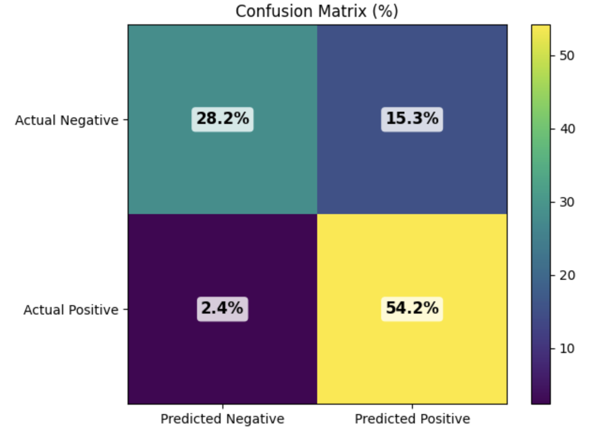
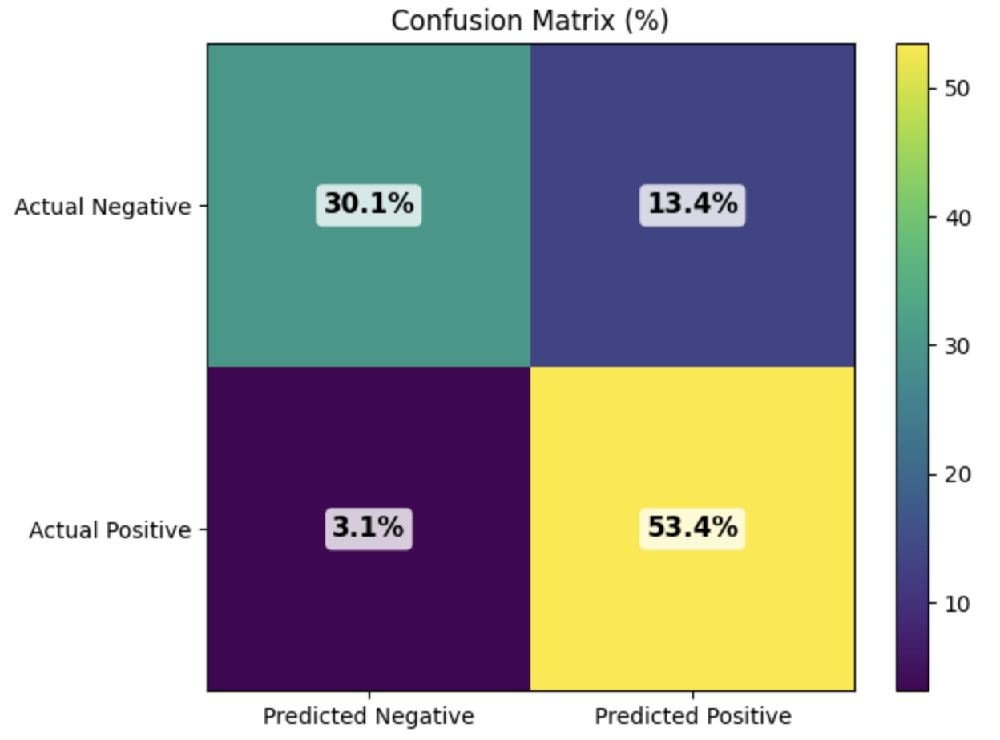
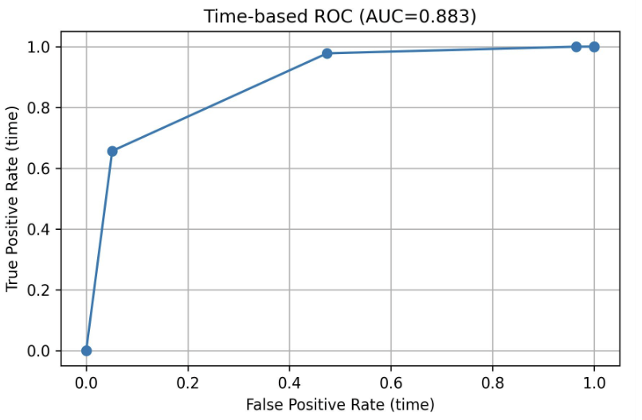
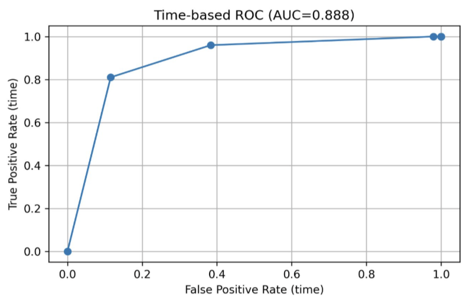
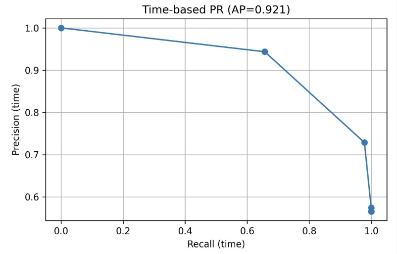
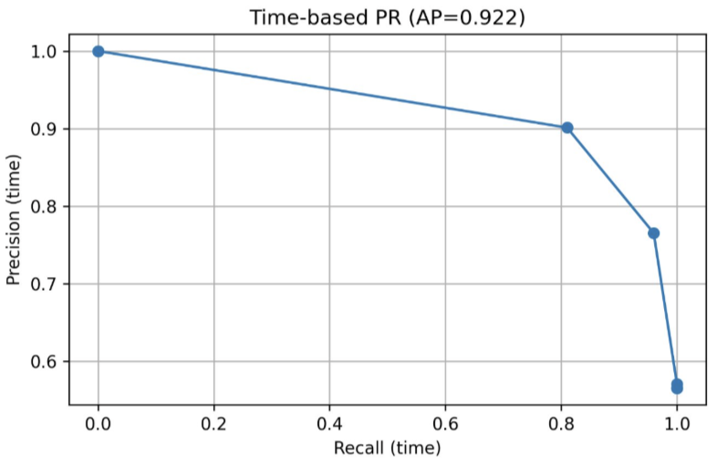

# Bird Vocalization Detection in Passive Acoustic Monitoring Systems

This repository provides the code and pretrained models for developing efficient deep learning approaches to bird vocalization detection in passive acoustic monitoring systems.

The project investigates lightweight deep learning detectors for identifying bird vocalization segments within long passive acoustic monitoring (PAM) recordings. Three detection approaches are implemented and compared: a YOLO-style spectrogram detector, a lightweight convolutional detector, and a transfer-learning detector built on a pretrained Whisper encoder. The lightweight convolutional detector is selected as the final model for CPU-based edge deployment (e.g. Raspberry Pi).

Pretrained checkpoints for both the convolutional and Whisper-based detectors are included in the repository root (`conv_based_detector.pt`, `whisper_based_detector.pt`). For details on the YOLO-style spectrogram detector, please refer to https://github.com/mohrsalt/yolo_based_detector

---

## 1. Setup

Clone the repository:

```bash
git clone https://github.com/mohrsalt/Bird_Sound_Detection.git
cd Bird_Sound_Detection
```

Create and activate the conda environment from the provided environment file:

```bash
conda env create -f requirements.yml
conda activate bird_sound_detection
```

---

## 2. Dataset Preparation

The dataset is built from the [BirdSet](https://huggingface.co/datasets/DBD-research-group/BirdSet) XCM configuration. Preparation proceeds in four steps: (1) download BirdSet and extract a manifest of "pure" single-species recordings, (2) split that manifest into train/test source pools, (3) generate synthetic multi-species training sessions, and (4) generate the held-out test sessions.

Before running, open each script under `data/` and update the hardcoded paths (`CACHE_DIR`, `INPUT_JSON`, `OUTPUT_ROOT`, etc.) to point to your own storage locations.

Step 1 — Download BirdSet and build the pure-sample manifests (quality A/B/C):

```bash
python data/download.py
```

Step 2 — Split the Quality A manifest into 80/20 train/test source splits:

```bash
python data/test_train_split.py
```

Step 3 — Generate the training dataset (top-20 species, ~150 hours of synthetic multi-species sessions):

```bash
python data/prepare_train_data.py
```

Step 4 — Generate the held-out test dataset (~10 hours):

```bash
python data/prepare_test_data.py
```

Each generated session is a 5+ minute recording constructed by concatenating 2–4 randomly selected bird species clips with 0.5–1.0 s silence gaps. Metadata JSON files containing ground-truth bird vocalization intervals are written alongside the audio and are used by both training and evaluation.

---

## 3. Training

To train the **lightweight convolutional detector**, follow the training procedure below. 

Before running, edit `train/train.py` to point `audio_root`, `spectrograms_root`, `index_root`, and `metadata_json_path` at the outputs of Step 3 above.

Launch training with:

```bash
python train/train.py
```

Key training settings (configurable inside `train/train.py`):

- Window offset: 0.5 s (50% overlap sliding windows, 1.92 s window size)
- Minimum window content ratio: 0.25
- Optimizer: Adam, learning rate 1e-4
- Mixed precision and LR scheduler enabled

The best checkpoint on the validation set is saved automatically.

---

To train the **Whisper-based detector**, switch the main model file before running training:

1. Rename the current `main.py` to `main_conv.py`
2. Rename `main_whisper.py` to `main.py`

Then run the same training command:

```bash
python train/train.py
```

## 4. Evaluation / Inference

Inference is performed by `evaluation/inference.py`, which loads a trained checkpoint, runs detection on each file in the test metadata JSON, and writes predictions (ground-truth intervals, predicted intervals, and logits) to a CSV. Edit the `trained_model`, metadata path, and audio `root` variables in the script before running:

```bash
python evaluation/inference.py
```

You can use either of the provided pretrained checkpoints in the repository root:

- `conv_based_detector.pt` — lightweight convolutional detector (1.58M parameters, CPU-friendly)
- `whisper_based_detector.pt` — Whisper encoder-based detector (20.69M parameters, GPU recommended)

After inference, compute time-based precision, recall, F1-score, ROC, and PR metrics with:

```bash
python evaluation/metrics.py
```

`evaluation/metrics.py` reads the predictions CSV produced by `inference.py` and converts frame-level logits into intervals using the configuration at the top of the file (FPS, sample rate, padding, minimum duration, minimum silence). Update the CSV path inside the script to match your inference output.

---

## 5. Results

### Detection performance comparison

Detection performance of the three model families on the 10-hour held-out test set, reported using time-based precision, recall, and F1-score. Best results per column are in **bold**, second-best are _underlined_.

| Model / Setting | # Parameters | Precision ↑ | Recall ↑ | F1-score ↑ |
|---|---|---|---|---|
| YOLO-based detector (only A) (baseline) | 25M | **0.84** | 0.74 | 0.79 |
| Conv-based detector (only A) | 1.58M | _0.78_ | **0.96** | _0.86_ |
| Conv-based detector (A/B/C combined) | 1.58M | 0.60 | 0.92 | 0.68 |
| Conv-based detector (A/B/C + Vox noise) | 1.58M | 0.66 | 0.93 | 0.77 |
| Whisper-based detector (only A) | 20.69M | _0.80_ | _0.94_ | **0.87** |

### Confusion matrices, ROC, and PR curves

<p align="center">
  
  
</p>
<p align="center"><em>Confusion matrices: Conv-Detector (left), Whisper-Detector (right).</em></p>

<p align="center">
  
  
</p>
<p align="center"><em>ROC curves: Conv-Detector (left, AUC = 0.883), Whisper-Detector (right, AUC = 0.888).</em></p>

<p align="center">
  
  
</p>
<p align="center"><em>Precision-Recall curves: Conv-Detector (left, AP = 0.921), Whisper-Detector (right, AP = 0.922).</em></p>

### Inference time comparison

Inference time measured on 5-minute audio clips under different hardware settings.

| Model | Hardware | Inference Time (per 5 min audio) ↓ |
|---|---|---|
| Whisper-based detector | GPU (A100) | ~2 minutes |
| Whisper-based detector | CPU | Not feasible |
| Conv-based detector | GPU (A100) | ~0.02 seconds |
| Conv-based detector | CPU | ~2.5–3 minutes |

### Impact on downstream bird species classification

Effect of using the convolution-based detector as a filtering stage before the AudioProtoPNet species classifier, evaluated on the 20-species test set.

| Configuration | cMAP ↑ | AUROC ↑ | Top-1 Accuracy ↑ |
|---|---|---|---|
| Classification without detection | 0.43 | 0.89 | 0.65 |
| Classification with Conv-based detection | **0.8287** | **0.9205** | **0.7193** |

### Deployment efficiency of convolution-based detector (on Raspberry Pi 5)

Computational resource usage of the deployed detection pipeline:

| Metric | Average Value |
|---|---|
| CPU utilisation | 4.08% |
| Memory usage | 610.99 MB |
| Peak memory usage | 626.0 MB |

Detection inference latency (measured on 1-minute audio segments):

| Metric | Value |
|---|---|
| Average inference time | 0.40 seconds |
| Maximum inference time | 2.02 seconds |

Storage requirements for raw and filtered audio data:

| Recording Type | Average File Size |
|---|---|
| Raw 1-minute recording | 1.92 MB |
| Trimmed bird segment | 150 KB |

---
## License

This project is licensed under the MIT License. See the `LICENSE` file for details.

## Acknowledgements

Parts of this project were inspired by or adapted from the following open-source repositories:

- https://github.com/skrbnv/javad
- https://github.com/skrbnv/spgdataset
- https://github.com/mohrsalt/yolo_based_detector

We acknowledge and thank the respective authors for their contributions to the open-source community.
